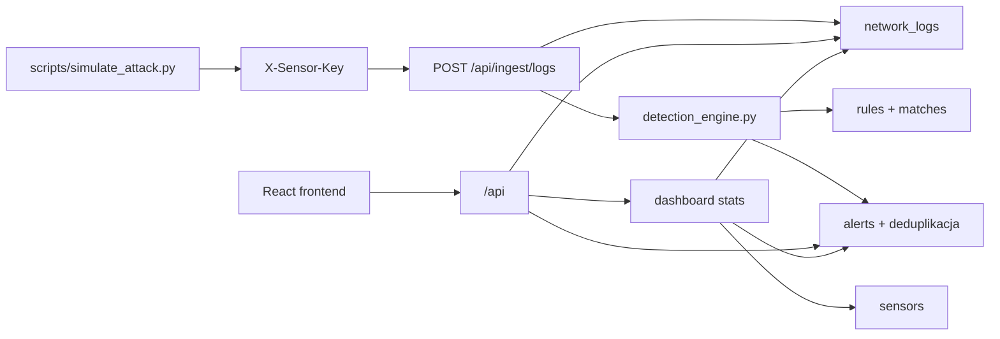

# Architektura MVP NDR

MVP sklada sie z backendu FastAPI, frontendu React/Vite, bazy PostgreSQL i lokalnego symulatora, ktory udaje ruch atakujacego hosta.



## Przeplyw danych

1. Symulator wysyla logi HTTP do `POST /api/ingest/logs` z naglowkiem `X-Sensor-Key`.
2. Backend upewnia sie, ze istnieja dane demo: uzytkownik, sensor, klucz sensora i trzy reguly.
3. Backend weryfikuje nazwe sensora i klucz.
4. Log jest zapisywany jako `NetworkLog`.
5. Silnik detekcji porownuje log i ostatnie logi z aktywnymi regulami.
6. Trafienie reguly tworzy `Alert` albo aktualizuje istniejacy otwarty alert o tym samym odcisku.
7. Frontend pobiera alerty, logi i statystyki przez REST API.

## Komponenty

| Komponent | Rola |
|-----------|------|
| `backend/app/routers/ingest_router.py` | Przyjmuje lokalne logi demo i uruchamia detekcje |
| `backend/app/services/detection_engine.py` | Minimalne reguly: port scan, SSH brute force, blacklist IP oraz deduplikacja otwartych alertow |
| `backend/app/services/demo_seed.py` | Tworzy demo usera, sensor i reguly startowe |
| `backend/app/routers/health_router.py` | Zwraca status API i polaczenia z baza |
| `backend/app/routers/alerts_router.py` | Zwraca paginowane alerty i aktualizuje status |
| `backend/app/routers/dashboard_router.py` | Zwraca liczniki zgodne z typem `DashboardStats` frontendu |
| `frontend/src/services/*` | Klient REST dla dashboardu, alertow, logow, sensorow i regul |
| `scripts/simulate_attack.py` | Lokalny generator logow testowych |

## Reguly detekcji MVP

| Regula | Warunek | Alert |
|--------|---------|-------|
| `Port Scan` | wiele roznych portow docelowych z jednego `src_ip` w krotkim oknie | `high` |
| `SSH Brute Force` | wiele prob TCP na port `22` z jednego `src_ip` | `critical` |
| `Blacklist IP` | `src_ip` albo `dst_ip` pasuje do demo blacklisty `203.0.113.66` | `critical` |

## Kontrakty API dla frontendu

`GET /api/alerts` zwraca:

```json
{
  "items": [],
  "total": 0,
  "page": 1,
  "page_size": 20
}
```

`GET /api/dashboard/stats` zwraca pola:

```text
alerts_24h
alerts_open
alerts_critical_open
sensors_online
sensors_total
packets_24h
by_severity
alerts_timeline
top_sources
```

`PATCH /api/alerts/{id}` zwraca zaktualizowany alert.

## Symulacja lokalnego ataku

Symulator ma trzy tryby:

```powershell
python scripts/simulate_attack.py --type port-scan
python scripts/simulate_attack.py --type ssh-bruteforce
python scripts/simulate_attack.py --type blacklist
python scripts/simulate_attack.py --type full-demo
```

Skrypt uzywa tylko lokalnego backendu `http://localhost:8000/api/ingest/logs`. Nie wysyla zadnego ruchu sieciowego poza HTTP do lokalnego API. Do ingestu dodaje naglowek `X-Sensor-Key: demo-sensor-key`.

## Stan poza MVP

Katalogi `zeek/` i `suricata/` sa obecnie zrodlem konfiguracji sensorow i nie sa mergowane jako pelne galezie. Integracja z realnym ruchem Zeek/Suricata moze zostac podlaczona pozniej przez ten sam przeplyw: parser logow -> `POST /api/ingest/logs` -> detekcja -> alerty.

## Znane ograniczenia (MVP)

| Obszar | Ograniczenie |
|--------|-------------|
| Sensor | Symulator HTTP — nie prawdziwy tap sieciowy (PCAP, Zeek, Suricata); ruch generowany syntetycznie |
| OSINT | Endpoint `/api/alerts/{id}/osint` zwraca stub — dane nie sa pobierane z AbuseIPDB w czasie rzeczywistym |
| Deduplication | Fingerprint SHA-1 oparty o `rule_id + src_ip + dst_ip + protocol`; brak obslugi alertow korelacyjnych laczacych wiele regul |
| Autoryzacja | JWT bez refresh tokena — sesja wygasa po uplywie TTL, wymagane ponowne logowanie |
| Skalowanie | Ingest synchroniczny (brak kolejki Celery/RabbitMQ); przy duzym wolumenie logów moze byc waskím gardlem |
| Frontend | Polling co 5s zamiast WebSocket — widoczne opoznienie przy szybkim naplywnie alertow |
| Baza danych | Brak row-level security; jeden schemat dla wszystkich uzytkownikow |

## Co dalej (planowane rozszerzenia)

- **Prawdziwy sensor** — integracja Zeek lub Suricata przez `backend/app/services/normalizer.py`; parser `eve.json`/`conn.log` → ingest API; przykladowe logi w `data/demo_logs/`
- **WebSocket / SSE** — zamiana pollingu na push dla natychmiastowych powiadomien o alertach
- **OSINT live** — podlaczenie klucza AbuseIPDB + VirusTotal + OTX; cache wynikow w Redis
- **ML anomaly detection** — Isolation Forest lub LSTM trenowany na ruchu baseline (Oskar)
- **Refresh token** — bezpieczniejsza sesja JWT z automatycznym odswiezaniem
- **Kolejkowanie** — Celery + Redis/RabbitMQ dla asynchronicznego procesowania logów pod duzym ruchem
- **SIEM export** — wyslanie alertow do Elastic, Splunk lub przez syslog
- **Multi-tenant / RBAC** — izolacja danych per-organizacja, pelne role viewer / analyst / admin
- **Deployment cloud** — Kubernetes + Helm lub Docker Swarm dla srodowisk wielosenzorowych

## Mozliwe rozszerzenia

| Obszar | Opis |
|--------|------|
| Realny sensor sieciowy | Integracja Zeek lub Suricata — parser `eve.json` / `conn.log` → ingest API |
| Real-time push | Zamiana pollingu na WebSocket lub SSE dla natychmiastowych powiadomien o alertach |
| OSINT rozszerzony | Dodanie VirusTotal i AlienVault OTX obok AbuseIPDB, caching wynikow |
| Anomaly detection | Wykrywanie statystycznych odchylen w wolumenie ruchu (Oskar) |
| SIEM export | Wyslanie alertow do zewnetrznego systemu (syslog, Elastic, Splunk) |
| RBAC | Pelnoprawne role: viewer tylko czyta, analyst moze zmienic status, admin zarzadza regulami i sensorami |
| Deployment cloud | Kubernetes + Helm lub Docker Swarm dla srodowisk wielosenzorowych |
