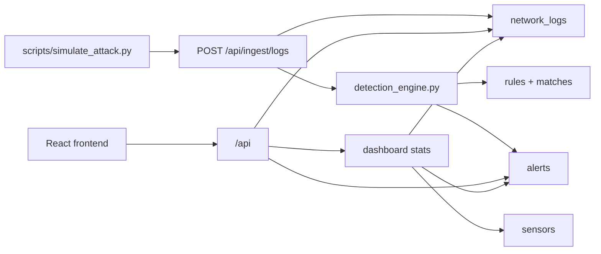

# Architektura MVP NDR

MVP sklada sie z backendu FastAPI, frontendu React/Vite, bazy PostgreSQL i lokalnego symulatora, ktory udaje ruch atakujacego hosta.



## Przeplyw danych

1. Symulator wysyla logi HTTP do `POST /api/ingest/logs`.
2. Backend upewnia sie, ze istnieja dane demo: uzytkownik, sensor i trzy reguly.
3. Log jest zapisywany jako `NetworkLog`.
4. Silnik detekcji porownuje log i ostatnie logi z aktywnymi regulami.
5. Trafienie reguly tworzy `Alert`.
6. Frontend pobiera alerty, logi i statystyki przez REST API.

## Komponenty

| Komponent | Rola |
|-----------|------|
| `backend/app/routers/ingest_router.py` | Przyjmuje lokalne logi demo i uruchamia detekcje |
| `backend/app/services/detection_engine.py` | Minimalne reguly: port scan, SSH brute force, blacklist IP |
| `backend/app/services/demo_seed.py` | Tworzy demo usera, sensor i reguly startowe |
| `backend/app/routers/alerts_router.py` | Zwraca paginowane alerty i aktualizuje status |
| `backend/app/routers/dashboard_router.py` | Zwraca liczniki zgodne z typem `DashboardStats` frontendu |
| `frontend/src/services/*` | Klient REST dla dashboardu, alertow, logow, sensorow i regul |
| `scripts/simulate_attack.py` | Lokalny generator logow testowych |

## Reguly detekcji MVP

| Regula | Warunek | Alert |
|--------|---------|-------|
| `Port Scan` | wiele roznych portow docelowych z jednego `src_ip` w krotkim oknie | `high` |
| `SSH Brute Force` | wiele prob TCP na port `22` z jednego `src_ip` | `critical` |
| `Blacklist IP` | `src_ip` albo `dst_ip` pasuje do demo blacklisty `203.0.113.66` | `critical` |

## Kontrakty API dla frontendu

`GET /api/alerts` zwraca:

```json
{
  "items": [],
  "total": 0,
  "page": 1,
  "page_size": 20
}
```

`GET /api/dashboard/stats` zwraca pola:

```text
alerts_24h
alerts_open
alerts_critical_open
sensors_online
sensors_total
packets_24h
by_severity
alerts_timeline
top_sources
```

`PATCH /api/alerts/{id}` zwraca zaktualizowany alert.

## Symulacja lokalnego ataku

Symulator ma trzy tryby:

```powershell
python scripts/simulate_attack.py --type port-scan
python scripts/simulate_attack.py --type ssh-bruteforce
python scripts/simulate_attack.py --type blacklist
```

Skrypt uzywa tylko lokalnego backendu `http://localhost:8000/api/ingest/logs`. Nie wysyla zadnego ruchu sieciowego poza HTTP do lokalnego API.

## Stan poza MVP

Katalogi `zeek/` i `suricata/` sa obecnie zrodlem konfiguracji sensorow i nie sa mergowane jako pelne galezie. Integracja z realnym ruchem Zeek/Suricata moze zostac podlaczona pozniej przez ten sam przeplyw: parser logow -> `POST /api/ingest/logs` -> detekcja -> alerty.
